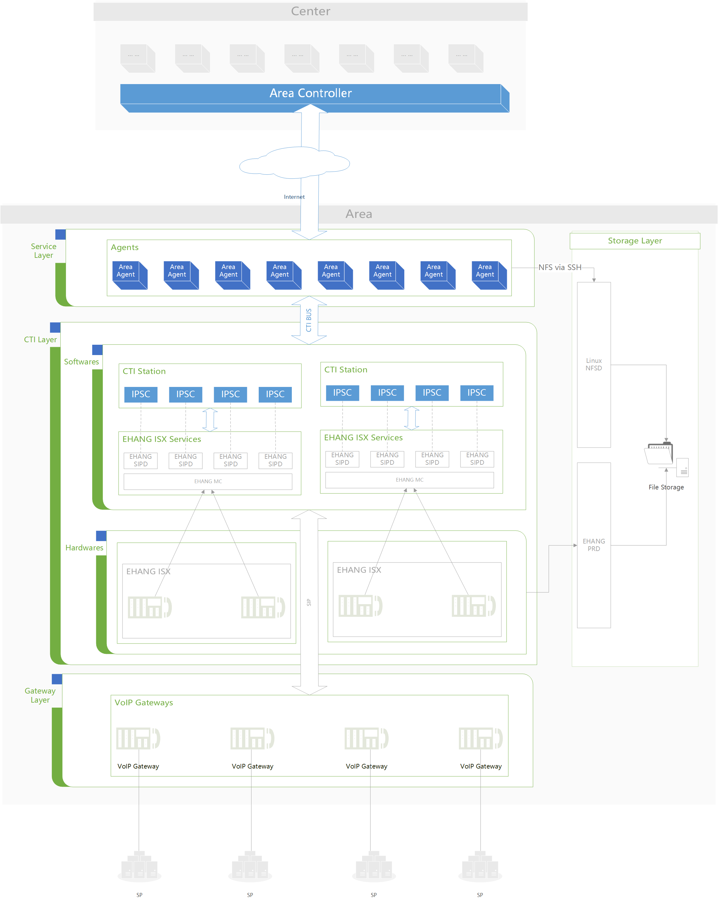

系统结构
##########

区域的系统结构如下图所示：

上图中的 `Area` 区域的 `Service Layer` 层和 `CTI Layer` 层的 `Softwares` 部分之间的交互控制是本文所描述的核心问题。

Service Layer
**************
即应用服务层。

它通过 :doc:`/cti-bus/index` 控制 `IPSC` ，进而实现呼叫、会议等 :term:`CTI` 资源的操纵。

应用服务使用 :doc:`/cti-bus/index` 的 **原生** 客户端库函数，
作为 **客户端** 连接到 :doc:`/cti-bus/index`。

:term:`CTI` Layer
******************
在区域中，应用服务直接面对的对象是 :term:`CTI` 服务程序(`IPSC`)。
`IPSC` 通过一系列 `流程` （别问我这个流程是什么，就把它当普通的程序吧 -_- ） 实现了基本 :term:`CTI` 功能，并通过 :doc:`/cti-bus/index` 暴露这些功能的接口。
